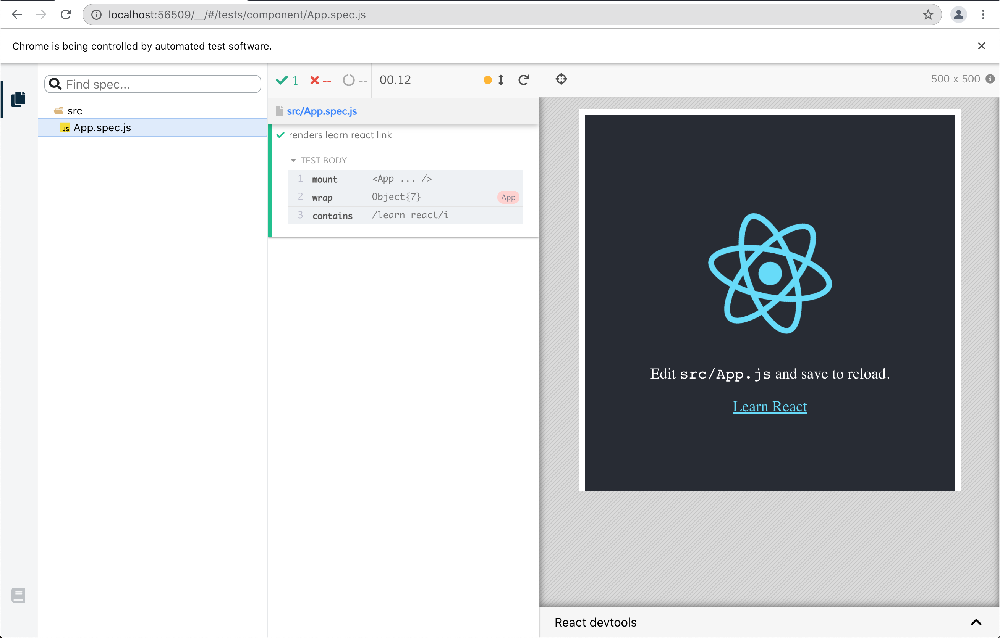
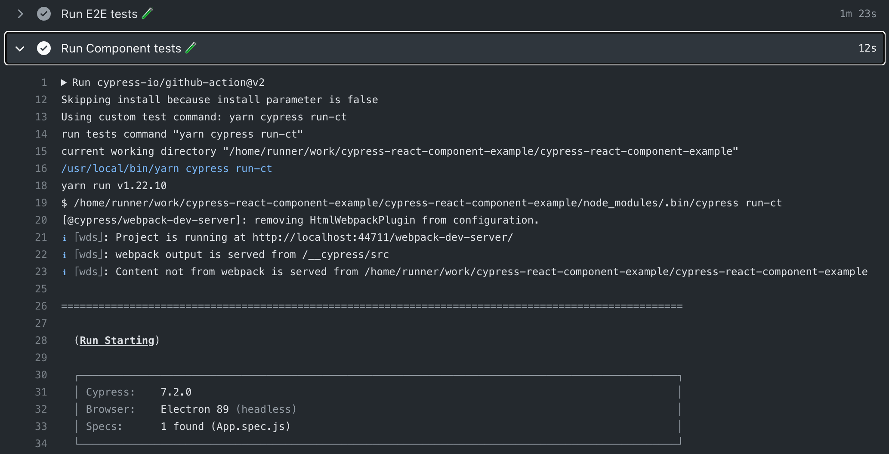

# cypress-react-component-example
[![ci status][ci image]][ci url] [![badges status][badges image]][badges url] [![renovate-app badge][renovate-badge]][renovate-app] 

> Run [Cypress component tests](https://on.cypress.io/component-testing) using [Cypress GitHub Action](https://github.com/cypress-io/github-action)

Create a new project using [Create React App](https://create-react-app.dev/)

```shell
$ npx create-react-app cypress-react-component-example
$ cd cypress-react-component-example
```

Added Cypress and component testing dependencies

```shell
$ yarn add -D cypress \
  @cypress/react @cypress/webpack-dev-server webpack-dev-server
```

If we open Cypress once, it creates E2E tests

```shell
$ yarn cypress open
```

Add the component settings to the [cypress.json](./cypress.json) file, pointing at the component tests that will be placed alongside the components in the [src](./src) folder.

```json
{
  "component": {
    "componentFolder": "src",
    "testFiles": "**/*spec.{js,jsx,ts,tsx}"
  }
}
```

Add the bundling setting for component specs in [cypress/plugins/index.js](./cypress/plugins/index.js) file

```js
// cypress/plugins/index.js
module.exports = (on, config) => {
  if (config.testingType === 'component') {
    require('@cypress/react/plugins/react-scripts')(on, config)
  }

  return config
}
```

Write the component test. When the project was created, it wrote [src/App.test.js](./src/App.test.js) component test file to be executed using Jest. Let's recreate the same test in Cypress:

```js
// src/App.spec.js
/* global cy */
import * as React from 'react'
import { mount } from '@cypress/react'
import App from './App'

it('renders learn react link', () => {
  mount(<App />)
  cy.contains(/learn react/i)
})
```

Launch the test runner with

```shell
$ yarn cypress open-ct
```

Click on the component spec file "App.spec.js" and enjoy 🚀



## Running on CI

Let's use [Cypress GitHub Action](https://github.com/cypress-io/github-action) to run all Cypress tests on CI. You can find the full workflow file in [.github/workflows/ci.yml](./.github/workflows/ci.yml) file. In summary, install and run E2E tests using the action, then call the action again, skipping the install and using a custom test command parameter:

```yml
- name: Run E2E tests 🧪
  uses: cypress-io/github-action@v2

- name: Run Component tests 🧪
  uses: cypress-io/github-action@v2
  with:
    # we have already installed everything
    install: false
    # to run component tests we need to use "cypress run-ct"
    command: yarn cypress run-ct
```



## Tips

If you see `'cy' is not defined  no-undef` linting error message, just add the global `cy` object comment to the spec file

```js
// src/App.spec.js
/* global cy */
```

[ci image]: https://github.com/bahmutov/cypress-react-component-example/workflows/ci/badge.svg?branch=main
[ci url]: https://github.com/bahmutov/cypress-react-component-example/actions
[badges image]: https://github.com/bahmutov/cypress-react-component-example/workflows/badges/badge.svg?branch=main
[badges url]: https://github.com/bahmutov/cypress-react-component-example/actions
[renovate-badge]: https://img.shields.io/badge/renovate-app-blue.svg
[renovate-app]: https://renovateapp.com/
